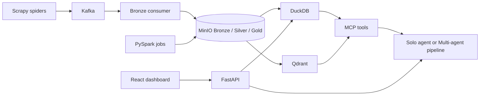

# Agentic Datalake 🌊🤖


> **"What if your data lake could talk back, understand context, and do its own research?"**

Welcome to the **Agentic Datalake**—a fully local, multi-agent financial intelligence platform. It's not just a place where data goes to sleep in Parquet files; it's a living ecosystem where data is ingested, refined, embedded, and actively analyzed by a team of AI agents.

Think of it as a data engineering project that accidentally became sentient.

## 🌟 Why Does This Exist?

Most data platforms are passive. You query them, they give you rows. 
I wanted a system that could proactively synthesize information. I built a complete **Lakehouse Architecture** (Bronze, Silver, Gold layers) and then strapped a **Multi-Agent AI** system on top of it using the Model Context Protocol (MCP).

If you want to understand how to bridge the gap between heavy-duty Data Engineering (Spark, Kafka, Lakehouse) and modern Generative AI (Multi-Agent, Semantic Search), you're in the right place.

## ✨ Feature Highlights

* **Lakehouse Architecture:** Bronze ➔ Silver ➔ Gold on MinIO, queried by DuckDB.
* **Semantic Search:** KeyBERT keywords plus MiniLM embeddings in Qdrant — not `LIKE '%keyword%'`.
* **Two independent agents:** a **Solo Agent** for tool-first Q&A, and a **Multi-Agent** pipeline (Planner, Researcher, Summarizer, Analyst, Synthesizer) for longer research reports. The dashboard opens each in its own tab; the multi-agent stack loads only when that window is used.
* **MCP Tooling:** Agents query the lakehouse through MCP tools, not by inventing SQL.
* **Ops dashboard:** Start/stop Scrapy spiders and Spark stages (silver, gold, indexer) from the React UI.
* **Observability:** Prometheus + Grafana for pipeline and agent metrics.
* **Local-first:** Docker Compose for infra. LLMs can be local (Ollama) or cloud (Gemini / OpenAI / Anthropic via `.env`).

## 🏗️ Architecture at a Glance

*(For a deep dive, see [System Architecture](docs/03_System_Architecture.md))*



Scrapers publish to Kafka. A Python consumer lands files in Bronze. Spark cleans and enriches Silver/Gold. DuckDB and Qdrant serve queries. Agents talk to the lakehouse only through MCP. The dashboard talks to FastAPI over REST.

## 🛠️ Technology Stack

* **Storage & Processing:** MinIO, DuckDB, Apache Spark, Kafka
* **AI & Search:** Qdrant, KeyBERT, Sentence Transformers
* **Backend:** FastAPI, MCP (Model Context Protocol)
* **Frontend:** React (Dynamic Dashboard)
* **Observability:** Prometheus, Grafana
* **Infrastructure:** Docker Compose

## 🚀 Quick Start

### 1. Clone the Repository
```bash
git clone <your-fork-or-clone-url>
cd agentic_datalake
```

### 2. Set up Python Environment
Create a virtual environment and install the required dependencies so you don't pollute your global Python installation:
```bash
python -m venv venv

# On Windows:
venv\Scripts\activate
# On Mac/Linux:
source venv/bin/activate

pip install -r requirements.txt
```

### 3. Follow the Installation Guide
I've put together a comprehensive, step-by-step guide to configure your `.env` variables and start the data infrastructure. 

👉 **[Read the Installation Guide](docs/00_Installation_Guide.md)**

### 4. Spin it up!

You can launch the entire platform (Infrastructure, Backend, Frontend, Health Checks) with a single command:

#### Option A: One-Command Startup (Recommended)

* **On Windows (PowerShell):**
  ```powershell
  .\scripts\start.ps1
  # To start without opening the browser automatically:
  .\scripts\start.ps1 -NoBrowser
  ```
* **On Linux / macOS (Bash):**
  ```bash
  ./scripts/start.sh
  # To start without opening the browser automatically:
  ./scripts/start.sh --no-browser
  ```

> 💡 **Tip:** The startup script automatically validates your environment, starts Docker infrastructure, verifies service health, launches FastAPI on port 8000, starts the React Dashboard on port 5173, and opens your browser (unless `-NoBrowser` / `--no-browser` is passed). All logs are conveniently written to the `logs/` directory (`backend.log`, `frontend.log`, `startup.log`, `healthcheck.log`). To stop everything cleanly, run `.\scripts\stop.ps1` (or `./scripts/stop.sh`).

#### Option B: Manual / Dual-Terminal Startup (Legacy Method)

If you prefer to run and inspect the backend and frontend in separate terminal windows manually:

**Terminal 1 (Backend & Infrastructure)** — from the **repository root**:
```bash
docker compose up -d
uvicorn src.serving.api.main:app --reload --port 8000
```

**Terminal 2 (Frontend):**
```bash
cd dashboard
npm run dev
```

Then open `http://localhost:5173`. The home page is the ops + search dashboard. Use **Ask Intelligence Agent** (`/chat`) or **Multi-Agent System** (`/multi-agent`) — each opens a new tab. Agents initialize on first request to that window (or on first `/api/chat` / `/api/chat/multi` call), not on dashboard load.

Copy `.env.example` to `.env` before starting. MinIO console defaults in Compose are `admin` / `password123` (override via `.env`). Grafana is `http://localhost:3000` (`admin` / `admin`).

---

## 📚 Documentation

The real treasure of this repository isn't just the code—it's the documentation. I treat our docs like a first-class citizen. 

If you want to understand *how* this was built and *why* I made the decisions I did, start here:

* 📖 **[Documentation Index](docs/README.md)** — table of contents
* 🛠️ **[Installation Guide](docs/00_Installation_Guide.md)** — `.env`, Docker, API, dashboard
* 🗺️ **[Repository Tour](docs/02_Repository_Tour.md)** — where code actually lives
* 🤖 **[Multi-Agent System](docs/08_Multi_Agent_System.md)** and **[Solo Agent](docs/08b_Solo_Agent_Prototype.md)**
* 🖥️ **[Dashboard](docs/09_Dashboard.md)** and **[API Reference](docs/11_API_Reference.md)**
* 📓 **[Developer Journey](docs/developer_journey/01_The_Idea.md)** — how the project evolved

Folder-level notes also live next to the code (`src/README.md`, `dashboard/README.md`, `infra/README.md`, `tests/README.md`).

## 🤝 Contributing

Want to help make the Datalake even smarter? Check out our [Contributing Guide](CONTRIBUTING.md).

## 📜 License

This project is licensed under the MIT License - see the [LICENSE](LICENSE) file for details.
