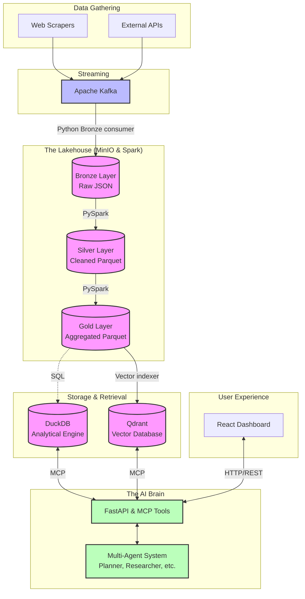

# 03 - System Architecture

To understand the Agentic Datalake, you have to look at it from two different angles. 

On the left side, we have the **Data Engineering Pipeline**—a rigorous, structured flow of information from the wild internet into a highly optimized storage format. On the right side, we have the **AI Application**—a dynamic, multi-agent system that queries that optimized storage to answer complex questions.

Here is the 10,000-foot view of how everything connects.

## 🗺️ The Big Picture

## 🧩 Component Breakdown

Let's walk through the major architectural blocks.

### 1. Data Gathering & Streaming
* **Scrapers:** Scrapy spiders that fetch financial news. The repository does not include a scheduler; spiders are started manually or by the dashboard.
* **Apache Kafka:** Kafka buffers normalized scraper payloads. The Python Bronze consumer reads the topic and writes objects to MinIO. This decouples scraping from downstream Spark processing.

### 2. The Medallion Lakehouse
I use **MinIO** (an S3-compatible object store) to hold the actual files, and **Apache Spark** to process them.
* **Bronze:** Raw data lands here exactly as the scraper found it. If a scraper breaks formatting, we don't lose the data; it just sits in Bronze until we fix the parser.
* **Silver:** Spark reads new Bronze objects, drops records missing critical fields, filters content shorter than 60 words, deduplicates by `article_id`, and writes Parquet to MinIO.
* **Gold:** The data is aggregated and optimized for read performance. 

### 3. The Retrieval Engines
Once data is in the Gold layer, it splits into two paths so our AI agents can query it effectively.
* **DuckDB:** The analytical powerhouse. It allows our API to run blazing-fast SQL queries directly against the Gold Parquet files in MinIO without needing to load them into a traditional database server like PostgreSQL.
* **Qdrant:** The semantic engine. Text data (like news articles) is run through an embedding model (Sentence Transformers/KeyBERT) and stored here. This allows agents to search by *concept* rather than just keyword.

### 4. The AI Application
* **FastAPI:** Exposes the API for the dashboard, but more importantly, it defines the **Model Context Protocol (MCP)** tools. These tools are Python functions that know how to query DuckDB and Qdrant.
* **Multi-Agent System:** A team of LLM-powered agents. The Planner decides what needs to be done, the Researcher uses the MCP tools to fetch data from DuckDB/Qdrant, and the Analyst/Summarizer package the final answer.

### 5. The Dashboard
* **React UI:** The front door for the user. It polls REST endpoints for articles, health, scraper/pipeline status, and logs. Multi-agent responses return the final report and completed workflow steps in one response; the current UI does not use token or SSE streaming.

---
⬅️ **Previous:** [02 - Repository Tour](02_Repository_Tour.md) | **Next:** [04 - Data Pipeline](04_Data_Pipeline.md) ➡️
