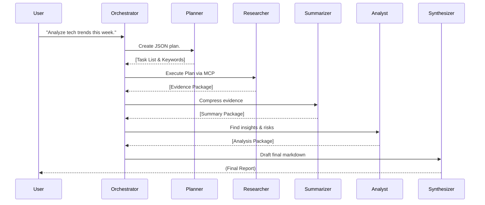

# 08 - Multi-Agent System

This is where the magic happens. 

If you ask a single LLM to query a database, read articles, and write a summary, it will get confused. It will drop instructions, hallucinate data, or simply run out of context window.

To solve this, I built a Multi-Agent System in `src/serving/agent/multi_agent/instructions.py`. I split the "brain" into five distinct personalities, each with a narrow focus, strict system prompts, and strict JSON output schemas.

## 👥 The Agent Roster

### 1. The Planner
* **Role:** The Project Manager.
* **Input:** The raw user query from the dashboard.
* **Output:** A structured JSON plan containing `research_keywords`, dates, and a task list.
* **Behavior:** The Planner has no tools. It cannot query the database. Its only job is to translate user intent into a strict, machine-readable execution plan.

### 2. The Researcher
* **Role:** The Data Gatherer.
* **Input:** The JSON plan from the Planner.
* **Output:** An "Evidence Package" (Raw JSON arrays of articles, trends, and entities).
* **Behavior:** The Researcher is the **only** agent allowed to talk to the Lakehouse. It executes the MCP tools (`retrieve_articles`, `get_daily_trends`, etc.) to gather facts. It doesn't analyze; it just fetches.

### 3. The Summarizer
* **Role:** The Information Compression Layer.
* **Input:** The Evidence Package from the Researcher.
* **Output:** A JSON object with extracted `themes`, `topic_clusters`, and `article_count`.
* **Behavior:** Raw database output is too noisy for deep analysis. The Summarizer groups similar articles together and removes redundancy.

### 4. The Analyst
* **Role:** The Reasoning Engine.
* **Input:** The Evidence Package + The Summary Package.
* **Output:** A JSON object containing `insights`, `risks`, `opportunities`, and a `confidence` score.
* **Behavior:** The Analyst looks at what the Summarizer found and interprets *what it means*. If the evidence is thin, it is instructed to set its confidence to "low".

### 5. The Synthesizer
* **Role:** The Communicator.
* **Input:** The Planner's Plan + Evidence + Summary + Analysis.
* **Output:** A beautifully formatted Markdown report.
* **Behavior:** The Synthesizer takes the dry JSON from the Analyst and writes the final response that the user actually sees. It adapts its tone—if the user asked a conversational question, it replies directly. If they asked for a report, it builds a structured document.

## 🔄 The Execution Pipeline

The orchestrator (`multi_agent_manager.py`) acts as the conductor for this orchestra. 

## 🧠 Strict JSON Hand-offs

The secret to making this pipeline stable is that agents 1 through 4 NEVER output markdown or raw text. They are prompted to output *only* valid JSON. The Orchestrator parses this JSON at each step and feeds it into the next agent. This prevents "LLM drift" where one agent starts hallucinating formatting that breaks the next agent.

---
⬅️ **Previous:** [07 - MCP and Tools](07_MCP_and_Tools.md) | **Next:** [09 - Dashboard](09_Dashboard.md) ➡️
